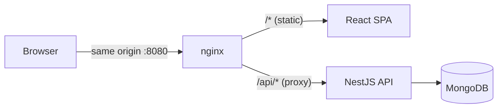

# Auth Module — NestJS + React (TypeScript)

[](https://github.com/Mitso98/easyg-auth-module/actions/workflows/ci.yml)

A production-minded sign-up / sign-in module: a **NestJS + MongoDB** API and a
**Vite + React (TypeScript)** SPA, served **same-origin** behind nginx so the
auth cookie works with no CORS and no CSRF token.

## Overview

- **Sign up** → argon2id-hashed account creation (one account per email, enforced
  by a unique index).
- **Sign in** → JWT issued in an **httpOnly, SameSite=Lax** cookie (never in the
  response body). Timing-uniform and anti-enumeration: unknown email and wrong
  password are indistinguishable.
- **Protected page** (`/app`) → gated by `GET /api/v1/auth/me`, which reads the
  cookie. **Sign out** clears it.

Deliberate extras beyond a bare auth form: confirm-password, a password eye
toggle, sign-out, a session-expiry banner, request-id correlation, Swagger docs,
and a threat model ([SECURITY.md](SECURITY.md)).

## Architecture



The browser only ever talks to **one origin** (nginx in Docker; the Vite dev
proxy locally). nginx serves the built SPA and reverse-proxies `/api/*` to the
backend. That single decision makes the `SameSite=Lax` cookie work, **removes
CORS entirely, and removes the need for a CSRF token**.

**Auth flow:** `signup` → `signin` (sets cookie) → SPA hydrates via `GET /me` →
protected calls send the cookie automatically → `signout` clears it. A 15-minute
token expiry means a 401 will eventually occur; the SPA catches it and shows a
polite "session expired" banner on the sign-in page.

## Quick Start (one command)

Requires Docker (with Compose).

```bash
cp backend/.env.example backend/.env          # then set JWT_SECRET
#   generate one with:  openssl rand -base64 48
docker compose up --build
```

Open **http://localhost:8080**. The API is same-origin under `/api/v1/...`;
Swagger UI is at **http://localhost:8080/docs**.

## Local Dev

Run each package directly (Node **≥ 20.19 / 22.12** — Vite 8). Point the backend
at the compose Mongo (published on `localhost:27017`):

```bash
# terminal 1 — Mongo only
docker compose up mongo

# terminal 2 — backend (http://localhost:3000)
cd backend && cp .env.example .env   # set MONGO_URI=mongodb://localhost:27017/auth and JWT_SECRET
npm install && npm run start:dev

# terminal 3 — frontend (http://localhost:5173)
cd frontend && npm install && npm run dev
```

The Vite dev server proxies `/api` → `http://localhost:3000`, so the browser
stays **same-origin** and the cookie behaves exactly as it does in production.

## Environment Variables

Only `.env.example` files are committed (placeholders); real `.env` files are
gitignored. Boot fails fast if anything required is missing or invalid.

| Variable | Where | Notes |
|---|---|---|
| `NODE_ENV` | backend | `development` \| `production` \| `test` (gates the Secure cookie + pretty logs) |
| `PORT` | backend | API port (default `3000`) |
| `MONGO_URI` | backend | `mongodb://…` / `mongodb+srv://…`; **never logged** (carries credentials) |
| `JWT_SECRET` | backend | **≥ 32 chars**, no fallback (`openssl rand -base64 48`) |
| `JWT_EXPIRES_IN` | backend | access-token lifetime (default `15m`) |
| `CORS_ORIGINS` | backend | unused in the same-origin setup; only for a split dev setup |
| `LOG_LEVEL` | backend | pino level (default `info`) |
| `VITE_API_URL` | frontend | **relative** `/api/v1` (same-origin) — not an absolute URL |

## API Docs

- **Swagger UI** at `/docs`, raw spec at `/docs-json`.
- A generated **`openapi.json`** is committed at the repo root as the FE/BE
  contract and re-generated + uploaded as a CI artifact (`npm run openapi:gen`).

| Method | Path | Auth | Purpose |
|---|---|---|---|
| `POST` | `/api/v1/auth/signup` | – | Create an account |
| `POST` | `/api/v1/auth/signin` | – | Sign in (sets the cookie) |
| `POST` | `/api/v1/auth/signout` | – | Clear the cookie |
| `GET`  | `/api/v1/auth/me` | cookie | Current user |
| `GET`  | `/health` | – | Mongoose ping (excluded from prefix/versioning) |

## Testing

```bash
cd backend  && npm test     # Jest + Supertest + mongodb-memory-server (in-process)
cd frontend && npm test     # Vitest + React Testing Library (jsdom)
```

Backend (~18): password-policy units; signup/signin/`me` integration; the
**duplicate-email** invariant; identical responses for wrong-password vs
unknown-email; a **timing test** proving `verify` runs once on both failure
paths; a throttle (429) test. Frontend (~10): schema rules, a form validation
test, and a ProtectedRoute redirect test.

Out of scope (deliberate next steps): Playwright e2e, testcontainers, coverage
upload.

## Deployment

The headline is the **one-command `docker compose up`** — fully reproducible,
same-origin. A live deploy is an optional stretch; if done it must stay
**same-origin** (reverse-proxy the API under the SPA origin, or serve the SPA
from Nest) and set `NODE_ENV=production` + `trust proxy` + `X-Forwarded-Proto`
so the `Secure` cookie sets behind TLS. A cross-site `pages.dev → onrender.com`
split would silently drop the cookie.

**Zero-downtime** is inherited, not hand-built: `/health` + graceful shutdown are
the primitives. Managed platforms give health-gated rolling deploys for free;
the nginx topology enables blue-green (`api_blue`/`api_green` upstreams +
`nginx -s reload`) as a one-config-change next step. A single free instance
restarts in place (brief blip).

## Decisions

| Area | Now | Documented next step |
|---|---|---|
| HTTP engine | Express (default) | Fastify rejected — invisible behind an argon2-bound endpoint |
| Hashing | `@node-rs/argon2` (argon2id, prebuilt) | avoids the node-gyp/native-build Docker trap |
| JWT | access-only 15m, httpOnly cookie | refresh rotation + reuse detection (RFC 9700) |
| Topology | same-origin (proxy/serve-from-API) | Origin-allowlist guard *if* ever cross-site |
| Throttling | in-memory `@nestjs/throttler` | shared store (Redis) — current store resets on restart |
| Logging | `nestjs-pino` JSON + redaction | pino over winston; request-id correlation end-to-end |
| Tests | thin pyramid + `mongodb-memory-server` | Playwright e2e, testcontainers, coverage |
| CI/CD | unified build CI (no deploy) | CD intentionally out of scope for a screening task |
| Validation | zod (FE) / Joi env + class-validator (BE) | see [AI.md](AI.md) |

> No N+1 paths exist in single-user auth; list endpoints would batch with `$in`.

See **[AI.md](AI.md)** for the AI-assisted build log and **[SECURITY.md](SECURITY.md)**
for the threat model.

## Make targets

```bash
make up        # docker compose up --build
make test      # backend + frontend test suites
make openapi   # regenerate openapi.json
make verify    # lint + typecheck + test + docker build (mirrors CI)
```
